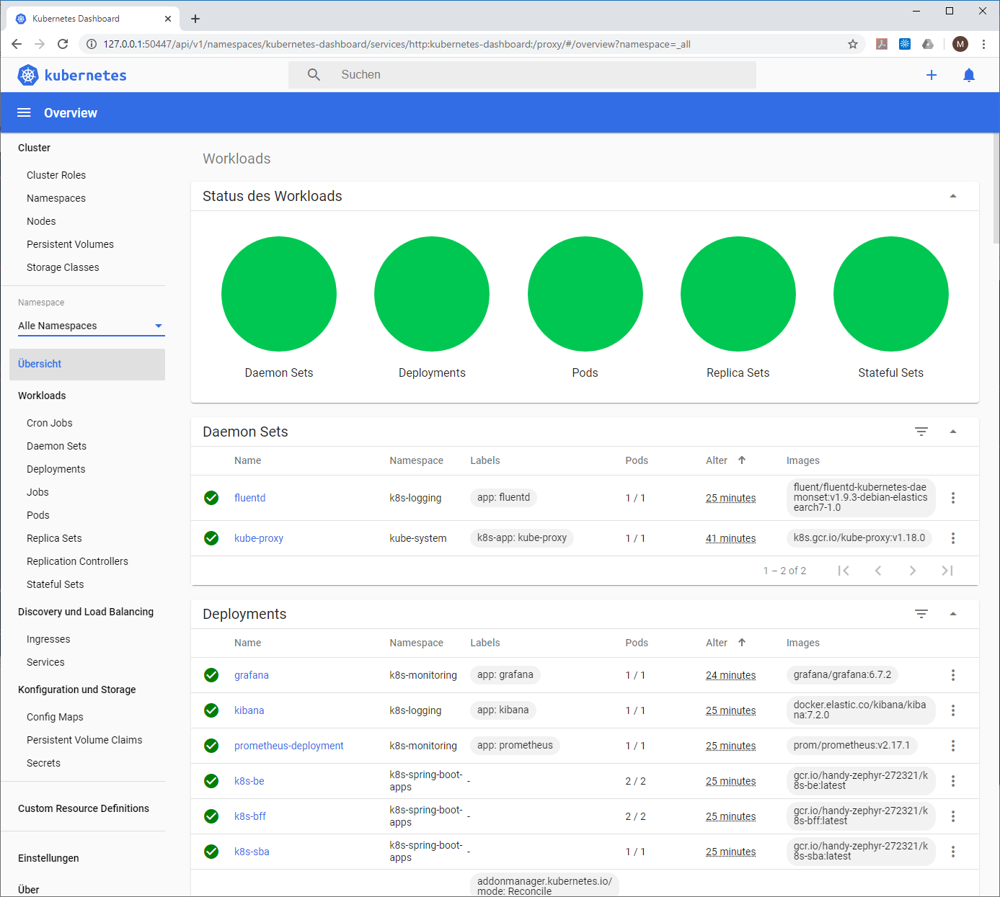
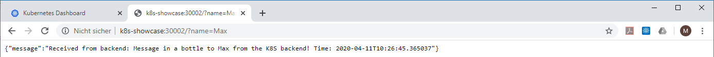
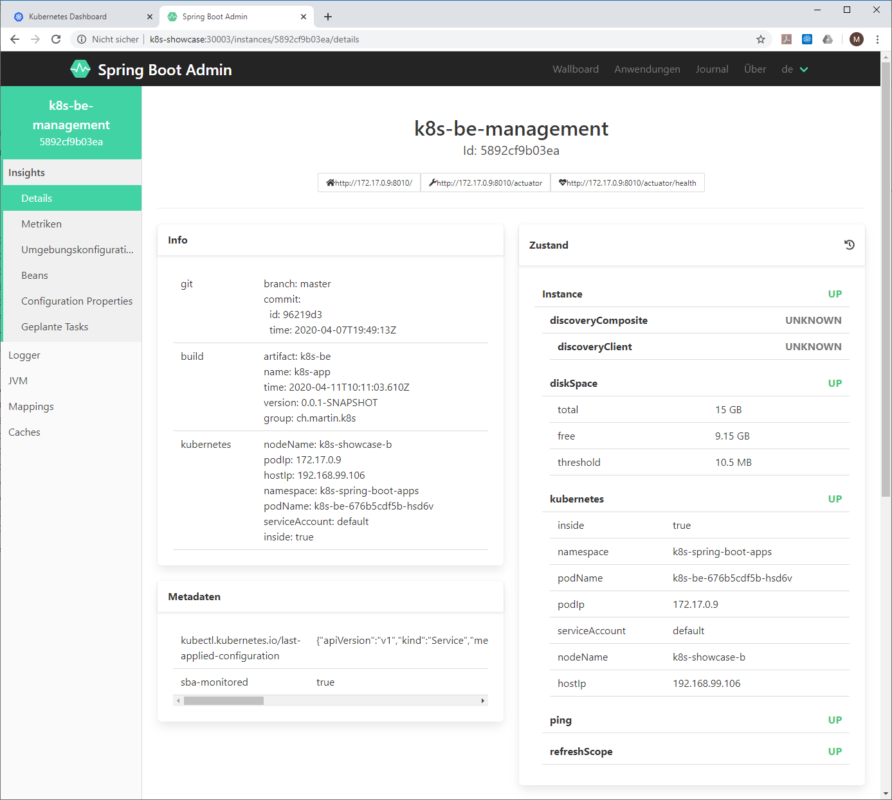

# k8s-showcase

This showcase highlights some key concepts for deploying Spring Boot applications to a Kubernetes cluster:

*   Creating docker images for the Spring Boot applications using the [JIB Maven plugin](https://github.com/GoogleContainerTools/jib) 
*   Integration of Spring Boot with Kubernetes using [Spring Cloud Kubernetes](https://spring.io/projects/spring-cloud-kubernetes) 
*   Dynamic configuration for Spring Boot with ConfigMap.
*   Readiness/Liveness Probes backed by Spring Boot health actuator.
*	Service lookup with Spring Boot's Feign Client and Kubernetes service object.
*	Service discovery with Spring Boot's discovery client
*   Monitoring of Spring Boot applications with [Spring Boot Admin](https://github.com/codecentric/spring-boot-admin)
*	Centralized and structured logging with a JSON logback appender.
*   Metrics scraping & analysis backed by Spring Boot's [Micrometer/Prometheus](https://docs.spring.io/spring-metrics/docs/current/public/prometheus) implementation.

The logging stack will consist of ElasticSearch, Fluentd and Kibana. For metrics and analysis we will install Prometheus and Grafana.

## Steps to install

### Create a Cluster on Minikube

This guide assumes that you have VirtualBox installed on your computer or a similar virtualization software.
Install [minikube](https://kubernetes.io/docs/setup/learning-environment/minikube/ "Minukube") on your local machine.
Create a cluster with the following parameters:

	minikube start -p k8s-showcase --memory='8192mb' --disk-size='16384mb' --vm-driver=virtualbox
 
You should see an output like this:

	* Creating virtualbox VM (CPUs=2, Memory=8192MB, Disk=16384MB) ...
	* Preparing Kubernetes v1.18.0 on Docker 19.03.8 ...
	* Enabling addons: default-storageclass, storage-provisioner
	* Done! kubectl is now configured to use "k8s-showcase"

Make sure that k8s-showcase is your current minikube profile. Execute `minikube profile k8s-showcase` and then verify the current profile with `minikube profile`.
You should see `* k8s-showcase` as confirmation.

### Start the Kubernetes Dashboard

The Kubernetes Dashboard is very useful when it comes to to track and monitor what is happening your cluster. Open a new command window or shell and start the Kubernetes Dashbord with `minikube dashboard`. This will open your Browser showing the inital Dashboard screen.

Next check the IP address which is assigned to your cluster with `minikube ip`. You will get a response like `192.168.99.104'`. Keep this IP address in mind or even better add it as host name `k8s-showcase` to `C:\Windows\System32\drivers\etc\hosts` (You need admin permission to do this). You will need it later to access the apps running inside the cluster.
 
### Deploy the Service Stack

Now here comes the magic of Kubernetes: You can install the full service stack at once. Navigate to the top level directory of the Git project and execute:

	kubectl apply -f k8s-deployment

This will apply all deployment files (*.k8s.yml) in the `k8s-deployment` directory on your minikube cluster.

### Verify Deployment

After a few minutes the cluster should have started all pods. Check the dashboard if everything is green:

 

You can now visit the installed apps by using the following links:

| URL                                  | Description                                                                                             |
|--------------------------------------|---------------------------------------------------------------------------------------------------------|
| <http://k8s-showcase:30001?name=Max> | Request to the backend (k8s-be). This will return a simmple message. It will also generate log message  |
| <http://k8s-showcase:30002?name=Max> | Request to the backend-for-frontend (k8s-bff). This will query the backend for a message and return it. |
| <http://k8s-showcase:30003>          | Opens the Spring Boot Admin UI                                                                          |
| <http://k8s-showcase:30004>          | Opens the Kibana UI                                                                                     |
| <http://k8s-showcase:30005>          | Opens the Prometheus Admin UI                                                                           |
| <http://k8s-showcase:30006>          | Opens the Grafana UI (Use admin/admin for first login)                                                  |

#### The Spring Boot Backend (k8s-be)

The backend is a simple REST service which will return the message "Message in a bottle" upon request. You can provide a name as parameter. The message text is configured as Kubernetes ConfigMap and can be changed without a restart. This is achieved using [Spring Cloud Kubernetes](https://spring.io/projects/spring-cloud-kubernetes) and Spring Boot's `@RefreshScope` annotation. (See deployment file `spring-boot-apps.k8s.yml`)

 

Calling this service will also produce log and metrics data which can be analyzed later.

#### The Spring Boot Backend (k8s-bff)

The backend-for-frontend uses a [Feign Client](https://cloud.spring.io/spring-cloud-netflix/multi/multi_spring-cloud-feign.html) which queries the backend for messages. The Feign Client is annotated with `@FeignClient(url = "http://k8s-be")` and automatically finds the backend with the service object's name `k8s-be`

Both Spring Boot applications provide a full set of [actuator endpoints](https://docs.spring.io/spring-boot/docs/current/reference/html/production-ready-features.html) which will be used by the following monitoring tools. 

#### Spring Boot Admin (k8s-sba)

The Spring Boot Admin application is used to gather build, configuration and health status information of the Spring Boot apps. It uses the discovery client provided with [Spring Cloud Kubernetes](https://spring.io/projects/spring-cloud-kubernetes) and scans the Kubernetes API for service objects with the label `sba-monitored: "true"`.

 

 	